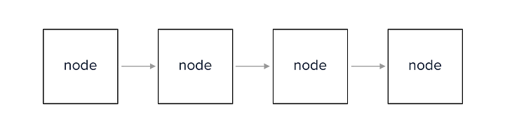
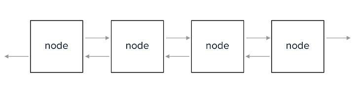
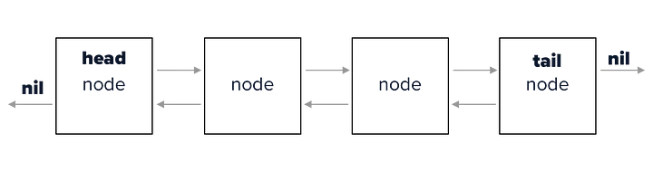

## Linked List ou Lista encadeada

Uma lista encadeada é uma estrutura de dados composta por uma coleção de nós. Cada nó contém dois elementos principais: dados e um ponteiro para o próximo nó na sequência. No caso de listas duplamente encadeadas, existe também um ponteiro para o nó anterior. Essa estrutura define a ordenação dos elementos com base na conexão entre os nós, e não por posições fixas na memória como arrays.

| Lembrando: Uma lista ligada é um sequência de itens do mesmo tipo.

Os nós se conectam por meio de ponteiros a outros nós.
Existem dois tipos:
- Lista encadeada simples (Singly Linked List)
- Lista duplamente encadeada (Doubly Linked List)




## Resume


## Conceitos importantes
O primeiro nó é chamado de cabeça (HEAD) e o último é chamado de cauda (TAIL)
- O ponteiro anterior do head é nulo assim como o próximo ponteiro do tail.



Swift não possui suporte nativo para listas encadeadas como em linguagens como Java. No entanto, estruturas similares podem ser implementadas manualmente, se necessário, usando classes ou structs.
Dentro do Java, implementamos as listas encadeadas usando a classe LinkedList, que é fornecida como parte da biblioteca padrão do Java.
- add(), remove(), get(), set() e outras operações são possíveis.


[Mais referências](https://beginnersbook.com/2013/12/difference-between-arraylist-and-linkedlist-in-java/)

```java
LinkedList<String> lista = new LinkedList<String>();
``` 